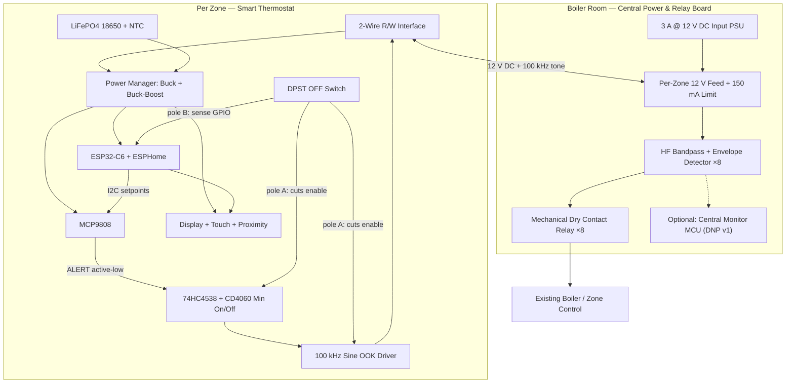
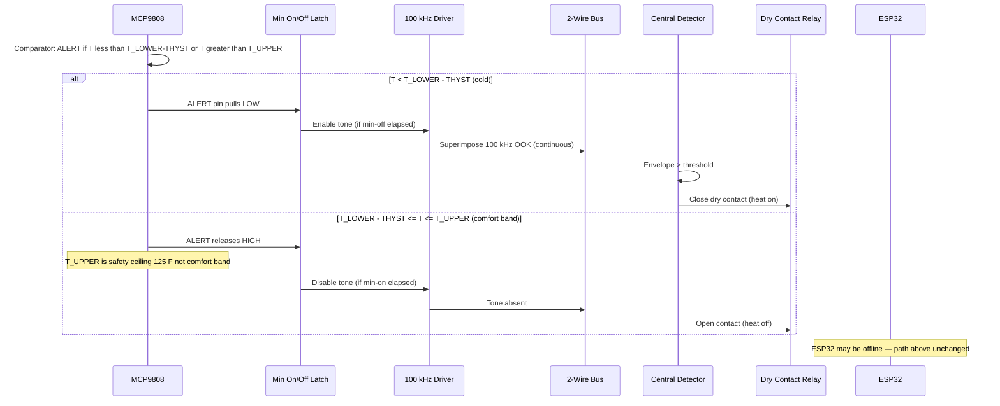
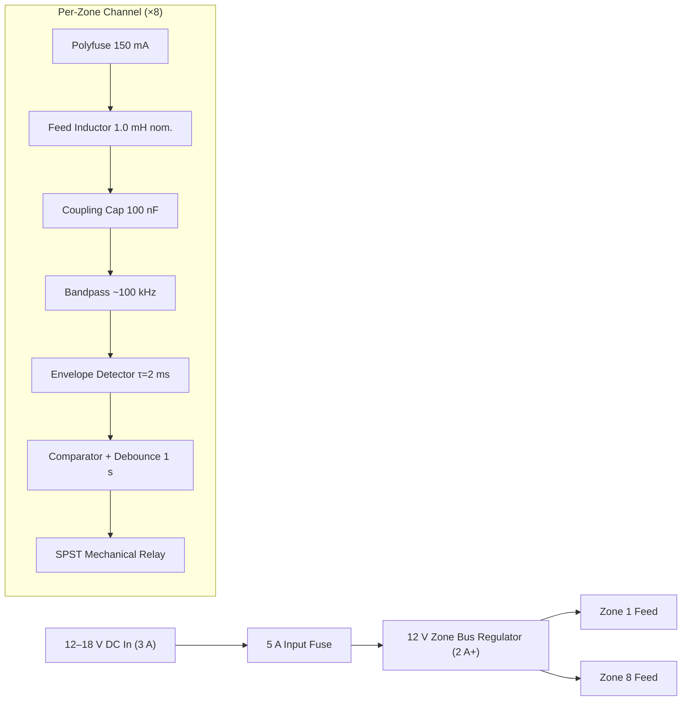
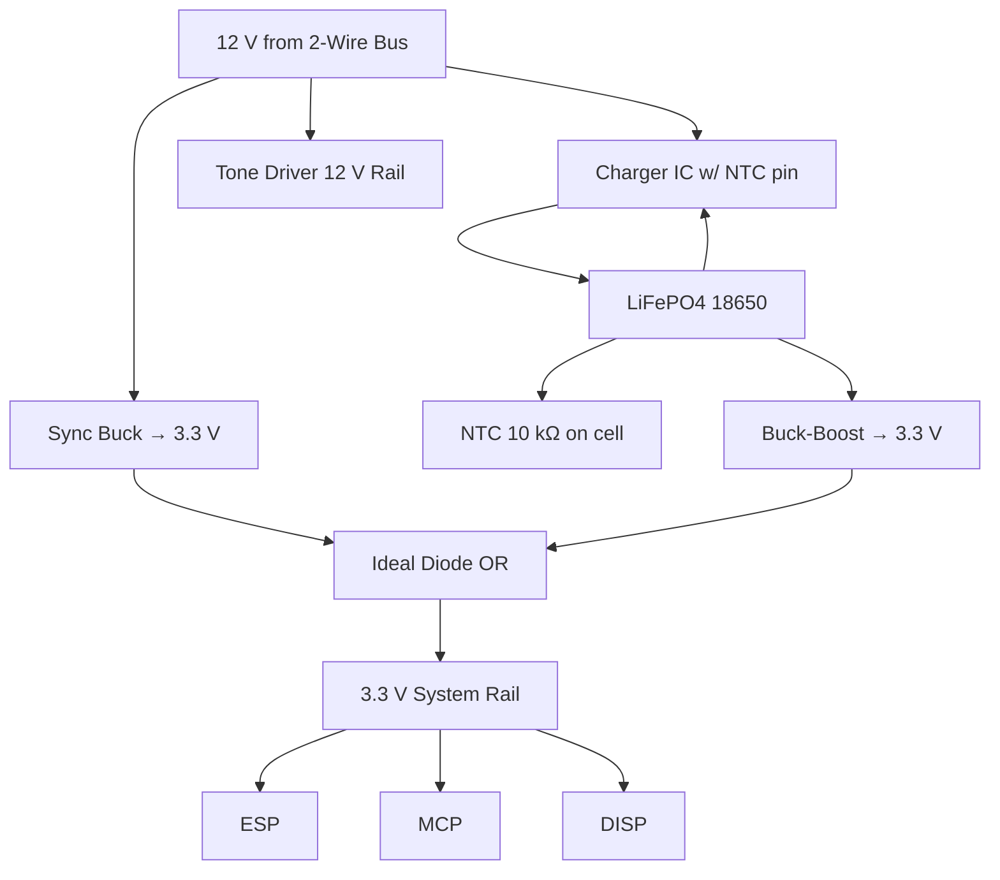
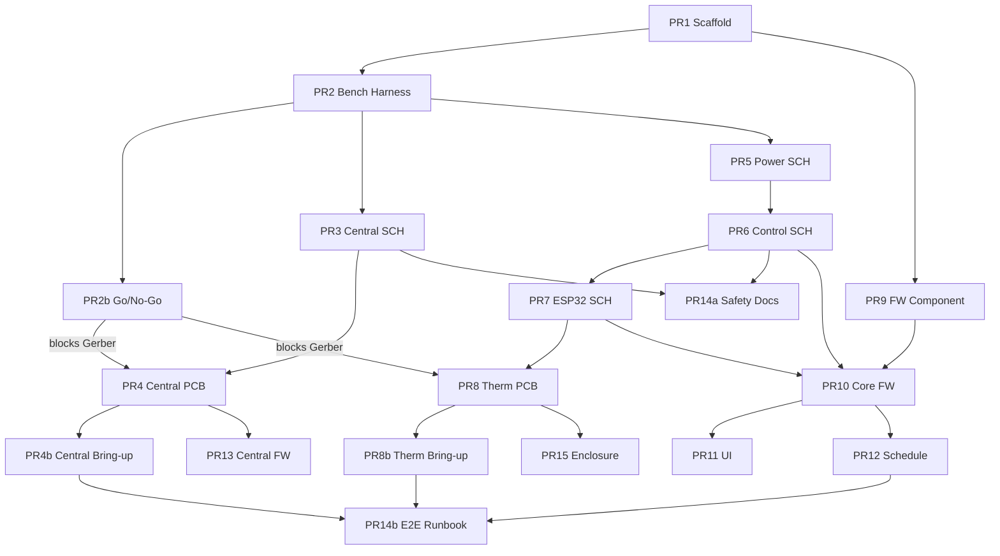

# Battery-Assisted Smart Hydronic Zone Thermostat System

| Field | Value |
|-------|-------|
| **Author** | TBD |
| **Date** | 2026-06-17 |
| **Status** | Draft (Rev 4 — re-review) |
| **Workspace** | `/home/sterling/projects/thermostat` (empty, greenfield) |
| **Scope** | DIY prototype — no UL/FCC certification path |

---

## Overview

This document specifies a two-board hydronic heating control system for an 8-zone residential installation. A **Central Power & Relay Board** in the boiler room sources 12 V DC on each zone's existing 2-wire (R/W) thermostat cable, detects per-zone heat calls via a superimposed ~100 kHz on-off keying (OOK) tone, and drives dry-contact relays into the legacy boiler control. Each **Per-Zone Smart Thermostat** provides local UI, WiFi connectivity via ESPHome, and schedule/setpoint management while preserving **fail-safe heat control** through a split-brain architecture: an MCP9808 temperature sensor and discrete tone-generation hardware operate independently of the ESP32-C6.

The thermostat draws primary power from the 2-wire bus and uses a single LiFePO4 18650 cell for backup and peak assist. Heat calls are encoded as a continuous HF tone on the same pair used for DC power; loss of tone causes the central board to release the zone relay (fail-safe off). Smart features (display, proximity wake, Home Assistant integration, OTA) run on the ESP32 but cannot block or falsely assert a heat call.

**Bench-validation gate:** No 8-zone or thermostat PCB Gerber order until PR 2b go/no-go criteria pass (see PR Plan).

---

## Background & Motivation

### Current State

- Hydronic multi-zone system with **8 zones**, heat-only.
- Each zone uses **2-wire thermostat cable** (20/2), max run **60 ft** to a centralized control box.
- Legacy thermostats: dry-contact closure on R/W at ~5 V DC intended; W returns to central control that operates zone valves and boiler interlock.
- Multi-zone coordination (boiler min runtime, pump logic) is handled by **existing boiler control** — out of scope.
- No cooling, fan, humidity, or remote room sensors.

### Pain Points

| Pain Point | Impact |
|------------|--------|
| Dumb thermostats | No scheduling, remote monitoring, or HA/HomeKit integration |
| Single setpoint per zone | No day/night setback without manual adjustment |
| No visibility | Cannot detect stuck valves, wiring faults, or abnormal temps |
| WiFi-only smart stats | Cloud or MCU failure can affect comfort or safety |
| 2-wire constraint | Cannot add a third wire; any solution must use the existing pair |

### Why This Architecture

1. **2-wire bus with DC + HF tone** reuses installed cable and matches the electrical model of dry-contact stats (closure = call for heat), but encodes "closure" as continuous tone presence.
2. **MCP9808 ALERT → latch → oscillator** path ensures the ESP32 is not in the critical heat-call chain.
3. **LiFePO4 backup** covers brief bus outages and supplies peak current for WiFi/display without sagging logic rails.
4. **ESPHome + Home Assistant** matches the user's existing home automation stack.

---

## Goals & Non-Goals

### Goals

| ID | Goal | Success Metric |
|----|------|----------------|
| G1 | Fail-safe heat control independent of ESP32 | Heat call path functions with ESP32 unpowered or held in reset |
| G2 | 8-zone support over 60 ft 20/2 cable | Reliable tone detect/decode at worst-case attenuation (validated in PR 2b) |
| G3 | 12 V DC bus power per zone | Thermostat operates from bus; battery is assist/backup only |
| G4 | Dry-contact output per zone to legacy control | Compatible with existing ~5 V DC sensing inputs |
| G5 | Day/night schedule + manual hold | 2 transitions/24 h when ESP32 is online **with valid time (SNTP or HA sync)** |
| G6 | Local UI: round touch display + proximity wake | Responsive touch; display off when idle |
| G7 | HA integration + HomeKit via HA bridge | State, setpoints, alerts visible in HA |
| G8 | Hydronic-appropriate cycling | Min on/off ~10 min enforced in hardware latch |
| G9 | OTA firmware updates | ESPHome OTA in scheduled window (LAN + password) |
| G10 | Physical OFF switch | Fully disables heat call and tone driver |

### Non-Goals

- UL/ETL, FCC Part 15 certification (EMI bench characterization still performed — see PR 2b)
- Cooling, fan, humidifier, or auxiliary heat control
- Floor/slab overtemperature protection (boiler handles this)
- Boiler sequencing, outdoor reset, or zone valve motor drive (existing control)
- Cloud dependency for heat control
- USB field access or battery swapping without opening enclosure
- Thread/Matter in v1 (planned later)
- Per-room remote temperature sensors

---

## Proposed Design

### System Architecture



### Heat Call Data Flow (Fail-Safe Path)



---

### Central Power & Relay Board

**Location:** Boiler room, adjacent to existing zone control inputs.

#### Block Diagram



#### Electrical Parameters

| Parameter | Value | Notes |
|-----------|-------|-------|
| Input voltage | 12–18 V DC | Boiler-room PSU; not AC |
| Input PSU rating | **3 A @ 12 V** minimum | See PSU sizing table below |
| Input fuse | **5 A** slow-blow | Ahead of regulator |
| Zone bus voltage | 12 V ±5% | Regulated after input |
| Per-zone current limit | **150 mA** (polyfuse) | 50 mA min steady; 150 mA hard limit |
| Tone frequency | 100 kHz ±2% | See KD14 |
| Tone modulation | OOK continuous while calling | No tone = no call (fail-safe) |
| Relay output | SPST dry contact (mechanical) | Across legacy R/W sense pair |
| Max cable length | 60 ft one-way home run | 20/2 copper |
| Conductor resistance | 10.4 Ω / 1000 ft (20 AWG) | Per single conductor |
| **DC loop resistance @ 60 ft** | **~1.25 Ω** | `R_loop = 2 × L × (10.4/1000)` = 2 × 60 × 0.0104 |
| **Voltage drop @ 60 ft** | **63–188 mV** | At 50–150 mA: `I × R_loop` |
| **Bus voltage at far thermostat** | **≥11.81 V** worst case | 12 V − 188 mV drop (before local regulation) |

**Loop resistance formula:**

```text
R_loop (Ω) = 2 × cable_length_ft × (10.4 Ω / 1000 ft)
           = 2 × 60 × 0.0104 ≈ 1.25 Ω

V_drop (mV) = I_mA × R_loop_Ω
            = 150 × 1.25 ≈ 188 mV
```

Bench measurements in PR 2b shall override these estimates for detector threshold and tone amplitude trim.

#### Central PSU Sizing

| Load | Per-Unit | ×8 Zones | Notes |
|------|----------|----------|-------|
| Thermostat steady + tone | 50–150 mA | 0.4–1.2 A | Polyfuse per zone; all zones may draw concurrently |
| Relay coil (Omron G5LE class) | 30–40 mA | 0.24–0.32 A | All relays may be energized simultaneously |
| Regulator + detector overhead | — | 0.1 A | Central board quiescent |
| **Max steady total** | — | **~1.6 A** | Design target |
| Inrush / headroom (×1.5) | — | **~2.4 A** | — |
| **Selected PSU** | — | **3 A @ 12 V** | 36 W; 5 A fuse |

**Current limiting strategy:** Per-zone **150 mA polyfuse** only (no global zone budget limiter). A single shorted zone trips its polyfuse without affecting others. Global 5 A input fuse protects PSU and wiring.

**Thermal:** 12 V regulator dissipation worst case: `(18 V − 12 V) × 1.6 A ≈ 9.6 W` — requires heatsink on input regulator if 18 V supply is used.

#### Tone Detection

Each zone channel:

1. **Feed inductor:** **1.0 mH nominal** (acceptable range **470 µH–2.2 mH** per bench tuning in PR 2b).
2. **Series capacitor:** 100 nF ceramic — couples tone, blocks DC.
3. **Bandpass filter:** centered at 100 kHz (2nd-order LC or active, Q ≈ 5–10).
4. **Envelope detector:** diode + RC, **τ ≈ 2 ms**.
5. **Comparator** with hysteresis; threshold set above idle noise floor (from PR 2b measurements).
6. **Output debounce:** **1 s** nominal (acceptable range 500 ms–2 s).

**Optional DNP footprints (v2 / optional MCU):** relay auxiliary contact input, envelope ADC tap, per-zone shunt for RMS — populate only if central MCU is installed.

#### Timing Budget (End-to-End Heat Call)

Technicians debugging zone demand must understand layered timing at thermostat vs. central board:

| Stage | Location | Nominal | Range | Notes |
|-------|----------|---------|-------|-------|
| MCP9808 compare + ALERT assert | Thermostat | <100 ms | — | Hardware comparator |
| Min-off gate blocks latch SET | Thermostat | 0–10 min | ±10% | CD4060 + 74HC4538 |
| Latch SET → tone enable | Thermostat | <1 ms | — | `TONE_EN` pull-up, default-off |
| Oscillator startup | Thermostat | 1–5 ms | — | Sine oscillator settle |
| Envelope detector rise | Central | ~5 ms | 2τ | τ = 2 ms |
| Central debounce | Central | 1 s | 0.5–2 s | Fast vs. latch — **central responds to tone edges, not 10 min latch** |
| Relay pull-in | Central | 5–15 ms | — | Mechanical relay |
| **Heat-call assert (cold → relay close)** | End-to-end | **~1 s** after tone present | If min-off elapsed | Dominated by central debounce |
| **Heat-call release (warm → relay open)** | End-to-end | **~1 s** after tone stops | If min-on elapsed | Tone stop is immediate; relay opens ~1 s later |
| Min-on hold (thermostat) | Thermostat | 10 min | 9–11 min | ALERT may deassert; tone continues until min-on expires |

**Key insight:** The 10 min min on/off latch runs **only at the thermostat**. The central board debounce (~1 s) is independent and much faster. During min-on hold with ALERT deasserted, tone continues → central relay stays closed. During min-off hold with ALERT asserted, tone is off → central relay stays open.

#### Protection

- Reverse polarity protection on input (P-FET or diode bridge + fuse).
- TVS on each zone bus terminal.
- Relay flyback diodes.
- ESD on field wiring terminals.

#### Optional Central MCU (v2 Telemetry)

An ESP32 on the central board is **optional and DNP for v1**. Relay drive is entirely analog from envelope detectors — **no firmware required for heat operation**.

If populated (v2), MCU adds:

- Per-zone demand binary sensors (comparator output tap)
- `zone_N_relay_state` via auxiliary contact inputs (DNP footprints)

**Deferred to v2** (require optional HW): `zone_N_tone_rms`, stuck-relay detection, heartbeat logging.

Planned path: `central-board/firmware/central-zone-monitor.yaml`

---

### Per-Zone Smart Thermostat

#### Split-Brain Component Assignment

| Function | Component | Bus Impact |
|----------|-----------|------------|
| Temperature measurement | MCP9808 (I2C) | None |
| Setpoint compare + hysteresis | MCP9808 internal | None |
| Heat call decision | MCP9808 ALERT (open-drain, active low) | None |
| Min on/off enforcement | 74HC4538 + CD4060 + SR latch | None |
| 100 kHz tone generation | Sine oscillator + FET bus driver | **Primary from 12 V bus** |
| Display, touch, proximity | GC9A01/ST7789 + CST816S + VCNL4040 | 3.3 V rail |
| WiFi, OTA, schedule | ESP32-C6 ESPHome | 3.3 V rail |
| Setpoint/schedule writes | ESP32 → MCP9808 limits via I2C | None |
| Absolute fault alerts | ESP32 reads MCP9808; publishes HA alerts | None |
| OFF switch sense | GPIO2 + pole B of DPST | None |

#### MCP9808 Configuration (Heat-Only — Critical)

**Problem:** In MCP9808 **Comparator mode** (CONFIG bit 0 = 0), Figure 5-10 shows active-low ALERT asserts when **T < T_LOWER − THYST** (condition 2) **or** **T > T_UPPER** (condition 3). If `T_UPPER` is set to the comfort-band edge (e.g., 71 °F), an overheated room (95 °F) would assert ALERT → latch → heat — a safety hazard.

**Solution:** Use **Comparator mode** with the real CONFIG register map (Register 5-2). Set `T_UPPER` to a **non-operating safety ceiling** well above any realistic room temperature (125 °F default), not the comfort hysteresis bound. Use `THYST[1:0]` for release hysteresis. Enable ALERT output via **Alert Cnt (bit 3) = 1** (power-on default is disabled).

##### I2C Register Pointers (Table 5-3 — Device Address 0x18)

Each register is a **single 16-bit value** accessed by writing the pointer byte, then reading/writing two data bytes. Pointers are **not** address ranges.

| Pointer | Register | Access | Purpose |
|---------|----------|--------|---------|
| `0x01` | CONFIG | R/W | Alert mode, THYST, locks (Register 5-2) |
| `0x02` | T_UPPER | R/W | Upper limit (16-bit, Table 5-1 format) |
| `0x03` | T_LOWER | R/W | Lower limit (16-bit) |
| `0x04` | T_CRIT | R/W | Critical limit (16-bit) |
| `0x05` | T_A | R | Ambient temperature (read-only) |
| `0x08` | Resolution | R/W | Measurement precision (0.0625–0.5 °C) — **not** THYST |

**PR 9a requirement:** Unit tests verify I2C pointer bytes (`0x02`, `0x03`, `0x04`, `0x01`, `0x05`) match Table 5-3 on the wire.

##### CONFIG Register Map (Pointer `0x01` — Register 5-2)

| Bit | Name | Heat-Only Value | Purpose |
|-----|------|-----------------|---------|
| 10–9 | **THYST[1:0]** | **`01`** | **Hysteresis: 1.5 °C (~2.7 °F)** — `00`=0, `01`=1.5, `10`=3, `11`=6 °C |
| 7 | Crit Lock | `0` | Allow T_CRIT writes |
| 6 | Win Lock | `0` during writes | Clear before limit writes; optional lock after |
| 5 | Int Clear | `0` | Not used in comparator mode |
| 4 | Alert Stat | read-only | Status flag |
| 3 | **Alert Cnt** | **`1`** | **Enable ALERT pin output (required)** |
| 2 | Alert Sel | `0` | `0` = all limits enabled; `1` = T_CRIT only |
| 1 | Alert Pol | `0` | Active-low ALERT |
| 0 | Alert Mod | `0` | Comparator mode (persistent ALERT while condition true) |

**Full heat-only CONFIG write:** `0x0208` = THYST `01` (bits 10–9) + Alert Cnt `1` (bit 3) + comparator/active-low defaults.

```text
0x0208 = 0x0200 (THYST=1.5°C) | 0x0008 (Alert Cnt=1)
Minimum enable only: 0x0008 (Alert Cnt=1, THYST=0°C — use full 0x0208 in production)
```

##### Limit Register Values (Pointers 0x02–0x04)

| Register | Pointer | Value | Purpose |
|----------|---------|-------|---------|
| `T_LOWER` | **`0x03`** | `target − offset` (e.g., 69 °F) | Heat-on threshold |
| `T_UPPER` | **`0x02`** | **`125 °F` safety ceiling** (configurable 100–125 °F) | **Not** comfort band — prevents over-temp false heat |
| `T_CRIT` | **`0x04`** | `+125 °C` (max) | Effectively disabled |
| Resolution | `0x08` | default (0.0625 °C) | Measurement precision only — leave at POR default |

**Comfort band vs. safety ceiling:** ESPHome/climate UI tracks `target` (e.g., 70 °F). MCP9808 `T_LOWER` (pointer `0x03`) is set to `target − hysteresis/2`. MCP9808 `T_UPPER` (pointer `0x02`) is always the **safety ceiling** (`SAFETY_UPPER_F` = 125 °F in NVS), independent of comfort setpoint. Release hysteresis comes from **CONFIG THYST[1:0]**, not Resolution.

**WIN_LOCK procedure:** Read CONFIG (`0x01`) → clear bit 6 → write CONFIG with THYST + Alert Cnt → write limits at `0x02`/`0x03`/`0x04` → optionally set bit 6.

**Verification (Phase 0 / PR 9 / PR 2b):**

| Test | Expected |
|------|----------|
| T < T_LOWER − THYST | ALERT active low → tone enabled (after min-off) |
| T_LOWER − THYST < T < T_UPPER | ALERT inactive → no heat call |
| **T = 95 °F with comfort limits (T_LOWER≈69 °F, T_UPPER=125 °F)** | **ALERT inactive → no heat call (F3)** |
| T > T_UPPER (safety ceiling breach, >125 °F) | ALERT asserts — fail-safe heat ON (extreme; boiler OT elsewhere) |
| ESP32 held in reset | Same as above — MCP9808 autonomous |

##### Temperature Register Format (`temp_f_to_reg`)

MCP9808 limit registers use a **non-standard 13-bit signed magnitude** format:

```text
Bit 15: sign (1 = negative °C)
Bits 14:12: fractional °C (unused in integer limits — use 0)
Bits 11:0: integer portion of temperature in °C

Resolution: 0.0625 °C per LSB in temperature register (0x05 ambient).
Limit registers: store integer + fractional in 13-bit format per datasheet Table 5-1.

Conversion (°F → register) — PR 9 unit tests required:
  1. temp_c = (temp_f - 32) × 5/9
  2. If temp_c < 0: sign bit = 1, magnitude = |temp_c|
  3. Encode magnitude: integer bits [11:4], fraction bits [3:0] at 0.0625°C steps
  4. Example: +25.0 °C → 0x0190 (per MCP9808 datasheet example)
  5. Example: 69.0 °F (20.56 °C) → verify against datasheet worked example in PR 9 tests
```

```cpp
// thermostat/firmware/components/mcp9808_thermostat/mcp9808_thermostat.cpp (planned)
// CONFIG bits per MCP9808 Register 5-2 — no MODESELECT field exists on this part.

static constexpr float SAFETY_UPPER_F = 125.0f;  // NVS-overridable; NOT comfort band
static constexpr uint16_t CONFIG_HEAT_ONLY = 0x0208;  // THYST=1.5°C (bits 10-9) + Alert Cnt=1 (bit 3)

bool Mcp9808Thermostat::configure_heat_only_alert() {
  mcp9808_->write_config_unlock();  // clear Win Lock (bit 6)

  // Pointer 0x01: Comparator, active-low, THYST=1.5°C, Alert Cnt=1
  // Alert Mod=0, Alert Pol=0, Alert Sel=0, Alert Cnt=1, THYST=01
  mcp9808_->write_config(CONFIG_HEAT_ONLY);  // 0x0208 per Register 5-2

  mcp9808_->set_critical_limit(MAX_TEMP_REG);  // pointer 0x04
  return true;
}

void Mcp9808Thermostat::apply_setpoint(float target_f, float hysteresis_f) {
  configure_heat_only_alert();
  const uint16_t lower = temp_f_to_reg(target_f - hysteresis_f / 2.0f);
  const uint16_t upper = temp_f_to_reg(SAFETY_UPPER_F);  // safety ceiling, NOT target+hyst
  mcp9808_->write_register(0x03, lower);  // T_LOWER pointer per Table 5-3
  mcp9808_->write_register(0x02, upper);  // T_UPPER pointer per Table 5-3
}
```

Default hysteresis: **1.5 °C via CONFIG THYST[1:0]=01** (bits 10–9 in pointer `0x01`). PR 9a `test_config_encode.cpp` asserts CONFIG `0x0208` after heat-only init and verifies I2C pointer bytes per Table 5-3.

**Absolute malfunction limits** (ESP32-managed, independent of schedule):

| Limit | Threshold | Action |
|-------|-----------|--------|
| `alert_cold` | 50 °F (10 °C) | HA notification; optional local UI banner |
| `alert_hot` | 95 °F (35 °C) | HA notification; **does not change MCP9808 limits or assert heat** |

#### Physical OFF Switch (Cut vs. Sense)

The OFF switch uses a **DPST** arrangement separating **hardware cut** from **GPIO sense**:

```text
Pole A (power interlock):  In series with TONE_EN / latch output enable
                           OFF position → open → tone driver disabled, latch cannot SET
Pole B (sense only):       SPST to GPIO2 (OFF_SENSE)
                           10 kΩ pull-up to 3.3 V on ESP32 side
                           Switch closed (RUN) → GPIO2 LOW; open (OFF) → GPIO2 HIGH

OFF does NOT remove:
  - 12 V bus input (ESP32/MCP9808 remain powered for UI "OFF" indication)
  - 3.3 V logic rail

OFF DOES remove:
  - Tone driver enable (hard cut)
  - Latch SET path (cannot enter heat call)
```

`binary_sensor.physical_off` (read-only) mirrors GPIO2: `ON` when switch is in OFF position.

Schematic: `thermostat/hw/sheets/off-switch.kicad_sch` — ERC checklist requires sense net independent of cut net.

#### Min On/Off Latch (Hydronic Cycling) — 74HC4538 + CD4060

**Decision (resolved — formerly OQ2):** Use **74HC4538 dual monostable + CD4060 14-bit counter + SR latch**. Reject 555 for 10 min timing (leakage/tolerance unacceptable).

**Timing (corrected):** CD4060 output `Qn` toggles at period **`T = 2^n / f_osc`**. Target **600 s (10 min)** at **Q10** (n=10):

```text
f_osc = 2^n / T = 2^10 / 600 = 1024 / 600 ≈ 1.71 Hz

CD4060 oscillator (datasheet):  f_osc ≈ 1 / (2.2 × R × C)

Example: R = 100 kΩ, C = 2.7 nF
  f_osc ≈ 1 / (2.2 × 100e3 × 2.7e-9) ≈ 1.68 Hz
  T_Q10 = 2^10 / 1.68 ≈ 609 s ≈ 10.2 min  (within ±10%)

Use Q10 (pin 13) for both min-on and min-off one-shots (74HC4538 triggered by Q10 edge).
Trim R on bench to achieve 540–660 s (9–11 min) at 25 °C ambient.
```

**PR 6 bench procedure:** Measure Q10 period with scope; record R/C; verify ±10% across 10–35 °C ambient.

**Default-safe:** `TONE_EN` held **low** via 10 kΩ pull-down. Latch output is **open-collector / active-high enable** — failure modes default to tone off.

##### State Machine

| # | ALERT | OFF_SW | POR | Min-On Timer | Min-Off Timer | Latch Q | TONE_EN | Notes |
|---|-------|--------|-----|--------------|---------------|---------|---------|-------|
| 1 | X | OFF | X | X | X | CLEAR | **0** | OFF switch dominates |
| 2 | X | RUN | 1 | X | X | CLEAR | **0** | Power-on default: no heat |
| 3 | HIGH | RUN | 0 | expired | X | CLEAR | 0 | Idle, warm |
| 4 | LOW | RUN | 0 | X | running | CLEAR | 0 | Cold but min-off not elapsed |
| 5 | LOW | RUN | 0 | X | expired | **SET** | **1** | Heat call active |
| 6 | HIGH | RUN | 0 | running | X | **SET** | **1** | Warm signal but min-on holds heat |
| 7 | HIGH | RUN | 0 | expired | X | CLEAR | 0 | Heat ends |
| 8 | LOW | RUN | 0 | expired | expired | SET | 1 | ALERT re-trigger during min-off: restart min-off timer, stay CLEAR |

**OFF switch while ALERT asserted (row 1):** Latch forced CLEAR, min-on timer reset, tone off. When OFF released, row 4 applies — min-off must elapse before heat resumes even if still cold.

**Simultaneous timer expiry:** Cannot occur — min-on and min-off are mutually exclusive states.

##### FMEA — Stuck-On Latch

| Failure | Effect | Detection | Prevention |
|---------|--------|-----------|------------|
| Latch stuck ON | Continuous tone → continuous heat | Central: heat call > 4 h alert; tone present with T > setpoint | `TONE_EN` default-off pull-down; power-on CLEAR |
| Latch stuck OFF | No heat | Room cold; ALERT low but no tone | User OFF/reboot; bench test in PR 6 |
| Timer drift | Shortened/longer cycles | Log duty cycle in HA | CD4060 trim on bench; ±10% acceptable |

**PR 6 deliverable:** `bench/latch-timing/test-procedure.md` — validate all state-machine rows on breadboard before PCB layout.

#### 100 kHz Tone Driver

- **Oscillator:** **100 kHz sine** (Colpitts or Wein) — see KD15. Reject square wave (harmonics interfere with AM broadcast and audio).
- **Bus driver:** N-FET or transformer-coupled injection via coupling cap.
- **Power source:** 12 V from bus — **not** from battery.
- **Amplitude target:** 200–500 mVpp at thermostat; central threshold << 50 mVpp after 60 ft attenuation (PR 2b measured).
- **OOK:** Latch `TONE_EN` enables oscillator. Continuous tone while heating.

#### Power Manager



| Rail | Source | Load Budget |
|------|--------|-------------|
| 3.3 V logic | Buck (bus) OR buck-boost (cell) | ESP32-C6, MCP9808, display, touch |
| 12 V tone | Bus only | ~5–15 mA |
| LiFePO4 charge | Bus via charger IC | **100 mA default** (see below) |

**Charger IC criteria (PR 5 BOM):**

| Requirement | Selection |
|-------------|-----------|
| Chemistry | LiFePO4 (3.0–3.6 V) |
| Charge current | **100 mA** (OQ7 resolved: preserves bus budget; 500 mA only if spare PSU headroom confirmed) |
| NTC / JEITA | Required — **charge disable below 0 °C** |
| CV voltage | **3.60–3.65 V** (LiFePO4 profile) |
| Part class | **LiFePO4-specific only** — e.g., **TP5000** (3.6 V CV, resistor-set current) or **CN3791** (3.65 V, NTC pin). **Do not use MCP73831** (Li-ion 4.2 V) or BQ24074 (Li-ion) |
| Ship behavior | No charge below 0 °C; ESP32 logs `battery_cold` sensor |

**PR 5 BOM acceptance:** Charger datasheet must state LiFePO4 / 3.6 V CV compatibility.

**Estimated average current (thermostat):**

| State | Current @ 3.3 V | Current @ 12 V bus |
|-------|-----------------|-------------------|
| T0 Deep sleep (ESP32 off, MCP on) | 0.5–1.5 mA | 2–5 mA |
| T2 Proximity UI active | 80–150 mA peaks | 5–10 mA |
| T3 Heating (ESP32 on, display off) | 15–30 mA avg | 10–20 mA |
| WiFi transmit peak | 250–350 mA peaks | 5–10 mA |
| Heating (tone on, ESP32 asleep) | +0.5 mA | +10–20 mA |

**Battery runtime (1500 mAh LiFePO4, bus failed):**

| Scenario | Estimated Runtime |
|----------|-------------------|
| T0 deep sleep during heat (ESP32 off, tone from bus — **N/A if bus failed**) | If bus failed: **no heat** (KD16); battery supports MCP9808 + UI only |
| T0 deep sleep, no heat, bus failed | **3–6 weeks** |
| T3 heating + WiFi, display off, bus failed | **~2–4 days** (15–30 mA avg) |
| T2 UI + WiFi active, bus failed | **~24–48 h** |

**No direct cell → 3.3 V:** Buck-boost required for 2.5–3.65 V range.

#### Display & UI

| Item | Selection |
|------|-----------|
| Primary | 1.28" round 240×240 IPS, GC9A01 or ST7789, SPI |
| Touch | CST816S or FT6336, I2C |
| Proximity | VCNL4040, I2C + INT pin |
| Fallback | 2" color LCD (ILI9341 class) |
| Physical control | DPST OFF switch only |

**Idle behavior:** Display off by default; proximity wake → active UI timeout 30–120 s.

**Display during heating (OQ6 resolved):** Display **off** during heating unless user triggers proximity wake. T3 = WiFi on, display off. No "always dim on heat" in v1.

#### ESP32-C6 Pin Mux & Deep-Sleep Wake

ESP32-C6 **RTC-capable GPIOs:** GPIO0–7 (usable as `deep_sleep` wake sources).

| Signal | GPIO | RTC? | Direction | Notes |
|--------|------|------|-----------|-------|
| I2C SDA (MCP9808, touch, prox) | GPIO18 | No | I/O | Requires re-init after wake |
| I2C SCL | GPIO19 | No | Output | — |
| SPI CLK (display) | GPIO6 | **Yes** | Output | Display powered down in sleep |
| SPI MOSI | GPIO7 | **Yes** | Output | Shared with OFF_SENSE — **resolve: move OFF_SENSE to GPIO2** |
| Proximity INT (VCNL4040) | GPIO4 | **Yes** | Input | **Primary wake source** |
| Touch INT (CST816S) | GPIO5 | **Yes** | Input | Secondary wake source |
| `HEAT_CALL_SENSE` (latch out) | GPIO3 | **Yes** | Input | T3 tier detection |
| `OFF_SENSE` (DPST pole B) | GPIO2 | **Yes** | Input | Pull-up; HIGH = user OFF |
| `BUS_ADC` (12 V divider) | GPIO0 | **Yes** | ADC | Bus presence monitoring |
| `BAT_ADC` (cell divider) | GPIO1 | **Yes** | ADC | Battery voltage |

**Revised OFF_SENSE = GPIO2** (GPIO7 used for SPI MOSI).

##### Wake Strategy

```yaml
# thermostat/firmware/packages/deep_sleep.yaml (planned)
# ESPHome: esp32_ext1_wakeup CANNOT be used together with wakeup_pin.
# wakeup_pin is single-pin only; multi-pin wake requires ext1 alone.

deep_sleep:
  id: deep_sleep_ctrl
  sleep_duration: 10min
  esp32_ext1_wakeup:
    pins:
      - GPIO4   # VCNL4040 proximity INT (active low)
      - GPIO5   # CST816S touch INT (active low)
    mode: ANY_LOW
```

- **T0 → T2:** EXT1 wake on GPIO4 or GPIO5 (active low). No `wakeup_pin` block.
- **Single-pin fallback:** If EXT1 unreliable, use `wakeup_pin: GPIO4` only (proximity primary) — mutually exclusive with ext1.
- **PR 10 CI:** Validate `deep_sleep.yaml` against ESPHome schema (`esphome config` compile check).
- **T1 periodic:** `sleep_duration: 10min` timer wake for HA publish.
- **T3 heating:** If `HEAT_CALL_SENSE` high, shorten sleep to 5 min or use light-sleep for WiFi (see fallback).
- **Fallback:** If deep-sleep wake proves unreliable on C6 in PR 10 acceptance test, use **light sleep** during T2/T3 with display/backlight powered down — target sleep current < 5 mA.

##### PR 10/11 Acceptance Tests

| Test | Criterion |
|------|-----------|
| Deep sleep current | < 2 mA @ 3.3 V (ESP32 off, display off) |
| Proximity wake latency | < 2 s from INT assert to display on |
| Touch wake latency | < 1 s |
| Post-wake I2C | MCP9808 read succeeds within 500 ms |

#### ESP32-C6 Firmware Architecture

```
thermostat/firmware/
├── thermostat-zone.yaml
├── packages/
│   ├── mcp9808.yaml
│   ├── display.yaml
│   ├── wifi.yaml
│   ├── deep_sleep.yaml
│   └── schedule.yaml
└── components/
    └── mcp9808_thermostat/
        ├── mcp9808_thermostat.h
        ├── mcp9808_thermostat.cpp
        └── test/test_temp_convert.cpp
```

**Sleep tiers:**

| Tier | Trigger | ESP32 | Display | WiFi |
|------|---------|-------|---------|------|
| T0 Deep sleep | Idle timeout | Off | Off | Off |
| T1 Periodic wake | RTC 10 min | Brief on | Off | Connect, publish, sleep |
| T2 Proximity active | GPIO4/5 wake | On | On | On |
| T3 Heating active | `HEAT_CALL_SENSE` + latch | On | **Off** (proximity can escalate to T2) | On |
| T4 OTA window | Schedule / HA cmd | On | Off | On |

---

### 2-Wire Bus Protocol Specification

#### Physical Layer

| Property | Value |
|----------|-------|
| Conductors | 20 AWG × 2, unshielded thermostat cable |
| DC polarity | R = +12 V, W = return (reverse polarity protection at thermostat) |
| Max length | 60 ft one-way home run |
| Tone | **100 kHz sine**, AC-coupled |

#### Link Layer — Heat Call Encoding

| State | Tone | Central Relay |
|-------|------|---------------|
| `HEAT_CALL` | Continuous 100 kHz | Closed |
| `IDLE` | Absent | Open |
| `FAULT` (broken wire / bus loss) | Absent | Open (fail-safe) |

**Fail-safe rule:** Any condition that stops tone → relay opens → heat off.

**Bus-fail behavior (KD16):** If central board loses power or bus is cut, **all zones stop calling for heat** (no tone → relays open). Thermostats continue local MCP9808 control but cannot reach boiler. User sees `bus_voltage = 0` in HA; battery sustains ESP32 for status only.

#### Optional Heartbeat (v2)

| Field | Value |
|-------|-------|
| Pattern | 50 ms tone burst every 30 s |
| Relay impact | None (envelope hold-off > burst period) |
| Purpose | Wire integrity monitoring |

---

### Schedule & Setpoints

#### Option A — Day/Night (v1)

Two transitions per 24 h:

| Transition | Default Time | Action |
|------------|--------------|--------|
| Wake | 06:00 | Apply `comfort_setpoint` |
| Sleep | 22:00 | Apply `sleep_setpoint` |

**Time source:** **SNTP primary**; Home Assistant time optional for drift correction.

```yaml
# thermostat/firmware/packages/schedule.yaml (planned)
time:
  - platform: sntp
    id: sntp_time
    servers:
      - 0.pool.ntp.org
    timezone: America/New_York   # from secrets
  - platform: homeassistant
    id: ha_time
    # Optional: improves accuracy when HA reachable; not required for schedule

on_time:
  - seconds: 0
    minutes: 0
    hours: 6
    then:
      - if:
          condition:
            lambda: 'return !id(hold_active);'
          then:
            - lambda: id(mcp_thermostat).set_target(id(comfort_temp));
  - seconds: 0
    minutes: 0
    hours: 22
    then:
      - if:
          condition:
            lambda: 'return !id(hold_active);'
          then:
            - lambda: id(mcp_thermostat).set_target(id(sleep_temp));
```

**Fallback behavior:**

| Condition | Schedule behavior |
|-----------|-------------------|
| ESP32 offline / deep sleep at transition | Missed until next T1 wake; then apply if transition window passed |
| ESP32 online, SNTP valid, HA down | **Schedule fires normally** |
| ESP32 online, SNTP unreachable | Use last known RTC; retry SNTP; no transition until time valid |
| Hold active | Skip scheduled transitions |

**PR 12 integration test:** Schedule fires at 06:00/22:00 with **Home Assistant stopped**; SNTP only.

#### Manual Hold

- User sets temp via touch UI → ESP32 writes MCP9808 limits immediately.
- `hold_active` NVS flag persists until "Resume Schedule."
- Hold does not bypass min on/off latch or OFF switch.

---

## API / Interface Changes

### ESPHome Entities (per zone)

| Entity | Type | R/W | Description |
|--------|------|-----|-------------|
| `climate.thermostat_zone_N` | Climate | RW | Heat-only; target/current temp; presets |
| `binary_sensor.heat_call` | Binary | R | `HEAT_CALL_SENSE` GPIO |
| `binary_sensor.proximity` | Binary | R | Display wake events |
| `binary_sensor.physical_off` | Binary | R | OFF switch sense (GPIO2); `true` = OFF position |
| `sensor.battery_voltage` | Sensor | R | Cell voltage |
| `sensor.bus_voltage` | Sensor | R | 12 V bus ADC |
| `sensor.battery_cold` | Binary/Sensor | R | NTC cold-charge inhibit active |
| `button.resume_schedule` | Button | W | Clears manual hold |
| `text_sensor.firmware_version` | Text | R | OTA tracking |

**Removed from v1:** `switch.physical_off` (replaced by `binary_sensor.physical_off` — read-only sense).

### Custom Climate Component Traits (PR 9)

ESPHome native MCP9808 is **temperature sensor only**. Custom `mcp9808_thermostat` must implement:

| Trait | Value |
|-------|-------|
| `CLIMATE_MODE_HEAT` only | No cool/auto/fan |
| `supports_two_point_target_temperature` | false |
| Presets | `home`, `sleep` (maps to comfort/sleep temps) |
| Away | Not in v1 |
| Hold | `hold_active` NVS; climate target writes set hold |
| Initial state on boot | Apply NVS target to MCP9808; do not heat until MCP9808 compares |
| WIN_LOCK | Unlock before write; return `false` on I2C NACK |
| Action | `CLIMATE_ACTION_HEATING` when `heat_call` true; else `IDLE` |

### I2C — ESP32 ↔ MCP9808 (Device Address 0x18, Table 5-3)

| Pointer | Register | R/W | Purpose |
|---------|----------|-----|---------|
| `0x01` | CONFIG | R/W | THYST[10:9], Alert Cnt/Sel/Pol/Mod, Win/Crit Lock |
| `0x02` | T_UPPER | R/W | Upper limit (safety ceiling, 125 °F default) |
| `0x03` | T_LOWER | R/W | Lower limit (heat-on threshold) |
| `0x04` | T_CRIT | R/W | Critical limit (set to max / disabled) |
| `0x05` | T_A | R | Ambient temperature (read-only) |
| `0x08` | Resolution | R/W | Measurement precision (not THYST) |

---

## Data Model Changes

### ESPHome NVS / Preferences

| Key | Type | Default | Description |
|-----|------|---------|-------------|
| `comfort_temp` | float | 70 °F | Day setpoint |
| `sleep_temp` | float | 64 °F | Night setpoint |
| `hysteresis` | float | 1.5 °F | MCP9808 T_LOWER offset + THYST |
| `safety_upper_f` | float | 125 °F | MCP9808 T_UPPER safety ceiling (not comfort band) |
| `hold_active` | bool | false | Manual override |
| `hold_temp` | float | — | Override target |
| `schedule_enabled` | bool | true | — |
| `wake_hour` | int | 6 | — |
| `sleep_hour` | int | 22 | — |
| `time_valid` | bool | false | Set after first SNTP sync |
| `last_schedule_applied` | int | — | Unix timestamp |
| `ota_window_start` | int | 2 | Hour 0–23 |
| `display_timeout_s` | int | 60 | — |
| `timezone` | string | from secrets | SNTP TZ |

### Central Board (optional MCU — v2 only)

| Key | Type | Version | Description |
|-----|------|---------|-------------|
| `zone_N_relay_state` | bool | v2 | Auxiliary contact |
| `zone_N_tone_rms` | uint16 | **v2** | Requires ADC front-end |
| `zone_N_last_heartbeat` | timestamp | **v2** | Requires heartbeat protocol |

---

## Alternatives Considered

(Unchanged from Rev 1 — ESP32-only rejected; dedicated MCU rejected; PLC deferred; 24 V AC rejected.)

---

## Security & Privacy Considerations

### Threat Model

| Threat | Severity | Mitigation |
|--------|----------|------------|
| Rogue device on zone bus injecting tone | Medium | Amplitude windowing; central threshold; physical access required |
| ESP32 compromise via OTA | Medium | **OTA password**; OTA only on LAN during T4 window; no unsigned remote push |
| WiFi credential theft | Low | WPA3; secrets in `secrets.yaml` (gitignored) |
| HA API exposure | Low | HA auth; local network only |
| Bus short / miswire | Medium | Per-zone polyfuse; reverse polarity protection |
| Battery overcharge / thermal | Medium | Charger IC with NTC; 0 °C charge inhibit |

**OTA signing:** Not in v1 scope. ESPHome supports compile-time signing but DIY key management is not operationalized. v2 may add `!include signing.yaml` with offline key. v1 relies on **OTA password + LAN-only + scheduled window**.

### Privacy

- No cloud telemetry by default.
- Temperature data stays on LAN.
- No camera/mic.

---

## Observability

(Logging, metrics, alerting — unchanged except central MCU telemetry marked v2.)

### Fail-Safe Verification Checklist (Phase 0 / 2)

| # | Test | Pass Criteria |
|---|------|---------------|
| F1 | Tone stop → relay open | < 2 s |
| F2 | ESP32 held in reset, T < T_LOWER − THYST | Heat call asserts |
| F3 | ESP32 held in reset, **T = 95 °F** (below 125 °F safety ceiling) | **No heat call** |
| F3b | ESP32 held in reset, **T > safety_upper_f (125 °F)** | ALERT asserts → heat call (expected comparator behavior; not a fail) |
| F4 | OFF switch | Tone off; relay open; `physical_off` true |
| F5 | 60 ft tone detect | Envelope > threshold with ≥ 3× margin |
| F6 | 8-zone simultaneous tone (PR 2b EMI) | No false triggers on inactive channels |

---

## Rollout Plan

**Timeline: 16–20 weeks** (solo DIY, includes fab lead time and one likely re-spin).

### Phase 0 — Bench Validation (Weeks 1–3)

- PR 2 + **PR 2b gate**
- Bus + tone over 60 ft; EMI 1 vs 8 sources; fail-safe F1–F6
- **No Gerber orders until PR 2b signed off**

### Phase 1 — Central Board (Weeks 4–7)

- PR 3, 4 (layout only), **PR 4b HW bring-up** after fab
- 1–2 zones populated; dry run

### Phase 2 — Single Thermostat Prototype (Weeks 8–13)

- PR 5–8, **PR 8b HW bring-up**
- **PR 14a safety checklist** before live hydronic connection
- One zone live with supervision

### Phase 3 — Multi-Zone Rollout (Weeks 14–20)

- Fleet thermostats; PR 14b full E2E
- HA dashboards

### MVP-Critical PRs (Single Zone)

PR 1, 2, **2b**, 3, 5, 6, 7, 9, 10, **14a** — minimum for one supervised live zone.

### Rollback

- Physical OFF switch; central fuse removal; legacy stats retained one season.

---

## Risks

| Risk | Severity | Likelihood | Mitigation |
|------|----------|------------|------------|
| Tone attenuation on 60 ft cable | High | Medium | PR 2b bench; adjustable threshold |
| EMI — 8 concurrent 100 kHz tones | Medium | Medium | Sine oscillator; PR 2b 1-vs-8 coupling test; reposition cable runs if needed |
| MCP9808 misconfigured alert mode | **Critical** | Low | T_UPPER=safety ceiling; Alert Cnt=1; F3 bench test |
| MCP9808 I2C corruption during brownout | Medium | Low | Series resistors; MCP9808 holds limits without clock |
| Min on/off latch stuck-on | High | Low | Default-off pull-down; FMEA; 4 h heat alert |
| LiFePO4 cold charge | Medium | Medium | NTC on charger; `battery_cold` entity |
| ESP32 deep sleep wake failure | Medium | Medium | EXT1 on RTC pins; light-sleep fallback |
| False heat call from noise | High | Low | Bandpass + 1 s debounce + continuous tone |

---

## Open Questions

| # | Question | Status | Owner |
|---|----------|--------|-------|
| OQ1 | Legacy control input voltage/current | Open | User / Phase 0 measure |
| OQ2 | Latch technology | **Resolved: 74HC4538 + CD4060** | HW |
| OQ3 | Heartbeat on bus | **Deferred to v2** | Design |
| OQ4 | GC9A01 vs ST7789 | Open | FW / PR 11 |
| OQ5 | Central MCU | **DNP for v1** | HW |
| OQ6 | Display during heating | **Resolved: off unless proximity** | UX |
| OQ7 | Charge current | **Resolved: 100 mA default** | HW |

---

## References

- MCP9808 datasheet — Table 5-3 register pointers, CONFIG Register 5-2 (THYST bits 10–9), Figure 5-10, limit format (Table 5-1)
- ESPHome ESP32-C6 — https://esphome.io/
- ESPHome deep sleep — https://esphome.io/components/deep_sleep.html
- ESPHome climate — https://esphome.io/components/climate/index.html
- ESPHome MCP9808 (sensor only) — https://esphome.io/components/sensor/mcp9808.html
- 20/2 wire: 10.4 Ω/1000 ft per conductor

---

## Key Decisions

| # | Decision | Rationale | Verification |
|---|----------|-----------|--------------|
| KD1 | Split-brain: MCP9808 + latch → tone; ESP32 non-critical | G1 fail-safe | F2, F3 |
| KD2 | 12 V DC + 100 kHz OOK on 2-wire | Reuse cable | PR 2b |
| KD3 | Tone driver from bus, not battery | Heat call survives cell loss | Bench |
| KD4 | 74HC4538 + CD4060 min on/off (~10 min) | Hydronic cycling; reject 555 | PR 6 bench |
| KD5 | LiFePO4 + buck-boost OR-ing | WiFi peak support | PR 8b |
| KD6 | SNTP primary; HA time optional | G5 without HA | PR 12 test |
| KD7 | Central v1: analog only; MCU DNP | No boiler-room firmware dependency | PR 4b |
| KD8 | Day/night 2-transition schedule | Simple v1 | PR 12 |
| KD9 | DPST OFF: pole A cuts enable, pole B senses | Resolves cut vs. sense | F4 |
| KD10 | No bidirectional bus in v1 | Analog simplicity | — |
| KD11 | DIY — no UL/FCC | Scope | — |
| KD12 | WiFi + deep sleep v1; Matter later | Maturity | PR 10 |
| KD13 | MCP9808 comparator + T_UPPER safety ceiling (125 °F) + Alert Cnt=1 | Prevents over-temp heat call at 95 °F | **F3** |
| KD14 | 100 kHz tone (not 30 kHz–1 MHz tunable) | Balance attenuation vs. EMI | PR 2b |
| KD15 | Sine oscillator (not square) | Lower harmonics / AM interference | PR 2b EMI |
| KD16 | Bus failure → all heat calls off | Fail-safe; battery = status only | F1, runbook |
| KD17 | Mechanical relay (not SSR) | Legacy dry-contact compatibility | OQ1 confirm |
| KD18 | 100 mA LiFePO4 charge + NTC 0 °C inhibit | Bus budget + cold wall safety | PR 5 |
| KD19 | T3 heating: WiFi on, display off | Battery life; OQ6 resolved | PR 11 |
| KD20 | PR 2b gate before Gerber release | Avoid 8-zone re-spin | Phase 0 |

---

## PR Plan

**Timeline:** 16–20 weeks. **Fab orders (PR 4, PR 8 Gerbers) require PR 2b sign-off.**

### PR 1: Repository Scaffold & Tooling

**Title:** `chore: initialize monorepo layout and development tooling`

**Files:** `README.md`, `docs/`, `.gitignore`, `.github/workflows/`, `toolchain/versions.md`

**Tool versions (pinned):**

| Tool | Version |
|------|---------|
| KiCad | **9.0** |
| ESPHome | **2025.5.x** (pin in `toolchain/esphome-version.txt`) |
| ESP-IDF (via PlatformIO) | **5.3.x** for `esp32-c6-devkitc-1` |
| PlatformIO espressif32 | **6.9.x** |

**CI:** `compile_only` ESPHome build (no hardware); KiCad ERC/DRC on `*.kicad_pro`

**Dependencies:** None

---

### PR 2: 2-Wire Bus & Tone — Bench Test Harness

**Title:** `feat: add bus protocol spec and bench test fixtures`

**Files:** `docs/bus-protocol.md`, `bench/tone-attenuation/`, `bench/emi/`

**Dependencies:** PR 1

**Description:** Bench setup for 60 ft 20/2; sine tone injection; central detector prototype.

---

### PR 2b: Bench Validation Report & Go/No-Go Gate ⛔

**Title:** `test: bench validation report — blocks PCB fab`

**Files:** `bench/reports/phase0-validation.md`, `bench/reports/go-no-go.md`

**Dependencies:** PR 2

**Blocks:** **PR 4 Gerbers, PR 8 Gerbers**

**Go/no-go criteria:**

| Criterion | Pass |
|-----------|------|
| Tone detected at 60 ft | Envelope ≥ 3× comparator threshold |
| Fail-safe release | Tone stop → relay open < 2 s |
| False trigger (ESP32 in reset) | 0 false heat calls in 1 h noise test |
| MCP9808 F3 | No heat at 95 °F with comfort T_LOWER and T_UPPER=125 °F safety ceiling |
| EMI 8-zone | No cross-talk false triggers on idle channels |

**Parallel OK:** PR 9–12 firmware may proceed; **no fab order** until signed off.

---

### PR 3: Central Board — Schematic (1 Zone + PSU)

**Title:** `feat(central-board): schematic with PSU sizing and zone channel`

**Files:** `central-board/hw/sheets/power-input.kicad_sch`, `zone-channel.kicad_sch`

**Dependencies:** PR 2 (not PR 2b — schematic may proceed)

**Acceptance:** 3 A PSU, 5 A fuse, 1.0 mH inductor, DNP ADC/relay-aux footprints

---

### PR 4: Central Board — 8-Zone PCB Layout

**Title:** `feat(central-board): 8-zone PCB layout`

**Files:** `central-board/hw/central-board.kicad_pcb`

**Dependencies:** PR 3, **PR 2b sign-off for Gerber order**

**Description:** Layout complete anytime; **Gerber release only after PR 2b**.

---

### PR 4b: Central Board — HW Bring-Up Test Log

**Title:** `test(central-board): assembled board bring-up log`

**Files:** `bench/bringup/central-board-log.md`

**Dependencies:** PR 4 (fab received)

**Description:** Power-on, per-zone current, tone detect, relay timing. Required before boiler connection.

---

### PR 5: Thermostat — Power Manager & Battery

**Title:** `feat(thermostat): power path with charger, NTC, buck-boost`

**Files:** `thermostat/hw/sheets/power-manager.kicad_sch`, `battery.kicad_sch`, `bus-interface.kicad_sch`

**Dependencies:** PR 2

**Acceptance:** Charger with NTC; 100 mA charge; 0 °C inhibit documented in BOM

---

### PR 6: Thermostat — Split-Brain Control Path

**Title:** `feat(thermostat): MCP9808, 74HC4538/CD4060 latch, sine tone, DPST OFF`

**Files:** `control-path.kicad_sch`, `min-on-off-latch.kicad_sch`, `tone-driver.kicad_sch`, `off-switch.kicad_sch`, `bench/latch-timing/`

**Dependencies:** PR 5

**Acceptance:** State machine table implemented; timing bench validation; ERC checks cut≠sense

---

### PR 7: Thermostat — ESP32-C6, Display, Proximity

**Title:** `feat(thermostat): ESP32-C6 pin mux per design doc`

**Files:** `esp32-c6.kicad_sch`, `display.kicad_sch`, `docs/pin-mux.md`

**Dependencies:** PR 6

**Description:** GPIO assignments match pin-mux table; RTC wake nets routed.

---

### PR 8: Thermostat — PCB Layout

**Title:** `feat(thermostat): PCB layout`

**Dependencies:** PR 7, **PR 2b sign-off for Gerber order**

---

### PR 8b: Thermostat — HW Bring-Up Test Log

**Title:** `test(thermostat): assembled thermostat bring-up log`

**Files:** `bench/bringup/thermostat-log.md`

**Dependencies:** PR 8 (fab received)

**Description:** Rails, sleep current, tone amplitude, MCP9808 F2/F3, latch timing.

---

### PR 9: ESPHome — MCP9808 Thermostat Component (3 Sub-PRs)

**Title:** `feat(firmware): mcp9808_thermostat custom climate component`

**Dependencies:** PR 1 (parallel with PR 2)

**Sub-deliverables:**

| Sub | Content | Acceptance |
|-----|---------|------------|
| 9a | Limit-register driver (pointers 0x02/0x03/0x04) + CONFIG 0x0208 + WIN_LOCK | Unit tests `test_temp_convert.cpp`, `test_config_encode.cpp` (assert 0x0208; verify pointer bytes) |
| 9b | Climate trait MVP (heat-only, hold, presets) | `compile_only` CI |
| 9c | HA discovery + HIL bench (F2, F3) | Manual checklist |

**Milestone review required before PR 10 merge.**

---

### PR 10: ESPHome — Core Thermostat Application

**Title:** `feat(firmware): core config with deep sleep and GPIO from HW`

**Dependencies:** **PR 6, PR 7, PR 9 milestone**

**Description:** `deep_sleep.yaml`, ADC, `heat_call`/`physical_off` sensors, SNTP, acceptance tests (sleep current, wake latency).

---

### PR 11: ESPHome — Display, Touch, Proximity UI

**Title:** `feat(firmware): display and proximity wake UI`

**Dependencies:** PR 10

**Description:** T2 wake; T3 display off during heat; proximity escalates T3→T2.

---

### PR 12: ESPHome — Schedule & Manual Hold

**Title:** `feat(firmware): SNTP schedule, hold, HA-off test`

**Dependencies:** PR 10

**Description:** Schedule fires with HA stopped; alert automations.

---

### PR 13: Central Board — Optional Monitor Firmware (v2)

**Title:** `feat(central-board): optional zone monitor (DNP HW)`

**Dependencies:** **PR 4 only**

**Description:** Firmware for optional MCU; reads comparator taps. Not required for relay operation.

---

### PR 14a: Early Safety Checklist & Runbook (Pre-Live)

**Title:** `docs: safety checklist before hydronic connection`

**Files:** `docs/safety-checklist.md`, `docs/fail-safe-tests.md`

**Dependencies:** **PR 3, PR 6**

**Description:** Required before Phase 2 live connection. F1–F6 + F3b procedures. F3 wording matches PR 2b: no heat at 95 °F, not generic `T > T_UPPER`.

---

### PR 14b: Full E2E Bring-Up Runbook

**Title:** `docs: end-to-end bring-up runbook`

**Files:** `docs/bringup-runbook.md`, `bench/integration/test-matrix.md`

**Dependencies:** PR 4b, PR 8b, PR 12

---

### PR 15: 3D Enclosure & Assembly Guide

**Title:** `feat(enclosure): printable case`

**Dependencies:** PR 8 (layout — not fab)

**Note:** Order prints after PR 8b fit check; **+2 week fab slack** in schedule.

---

### PR Dependency Graph



---

*End of document — Rev 4, 2026-06-17*