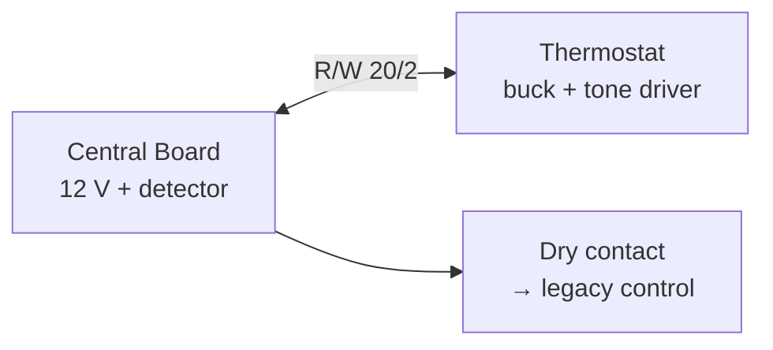

# 2-Wire Bus Protocol Specification

Normative reference for the hydronic zone thermostat bus. Derived from [DESIGN.md](../DESIGN.md) Rev 4.

| Field | Value |
|-------|-------|
| **Status** | Draft (PR 2) |
| **Scope** | 6-zone heat-only, 20/2 thermostat cable, bus-powered v1 |

---

## Overview

Each zone uses a single **2-wire pair** (R/W) for:

1. **DC power** — 12 V from the central board to the thermostat
2. **Heat-call signaling** — 100 kHz sine tone, AC-coupled (OOK: tone present = heat call)

The central board detects tone per zone via an **ADC I/Q amplitude detector** and drives **dry-contact relays** into legacy boiler control. Loss of tone is always **fail-safe off**.



---

## Physical Layer

| Property | Value | Notes |
|----------|-------|-------|
| Conductors | 20 AWG × 2, unshielded | Thermostat cable (e.g. 20/2) |
| Max home run | **60 ft** one-way | Worst-case attenuation target |
| DC polarity | **R = +12 V**, W = return | Reverse-polarity protection at thermostat |
| Bus voltage | 12 V ±5% | Regulated at central; ≥11.81 V at far end worst case |
| Per-zone current limit | **150 mA** polyfuse | 50–150 mA steady typical |
| Tone waveform | **100 kHz sine** | ±2% (98–102 kHz); see KD14, KD15 |
| Tone coupling | AC via series cap | DC blocked at detector and injector |
| Modulation | **OOK continuous** | Tone on = `HEAT_CALL`; absent = `IDLE` / `FAULT` |

### Loop Resistance (DC)

```text
R_loop (Ω) = 2 × cable_length_ft × (10.4 Ω / 1000 ft)

At 60 ft: R_loop ≈ 1.25 Ω
V_drop   = I_mA × R_loop  →  63–188 mV at 50–150 mA
```

Bench measurements in **PR 2b** override theoretical estimates for detector threshold and tone amplitude trim.

---

## Link Layer — Heat Call Encoding

| State | Tone on bus | Central relay | Thermostat behavior |
|-------|-------------|---------------|---------------------|
| `HEAT_CALL` | Continuous 100 kHz | **Closed** | Latch + oscillator enabled |
| `IDLE` | Absent | **Open** | No heat demand |
| `FAULT` | Absent (broken wire, bus loss, OFF switch) | **Open** | Fail-safe off |

**Fail-safe rule:** Any condition that stops tone → relay opens → heat off.

**Bus-fail (KD16):** Central power loss or cut bus → all zones lose tone → all relays open. Bus-only thermostats lose power and cannot assert heat.

### Optional Heartbeat (v2 — not implemented)

| Field | Value |
|-------|-------|
| Pattern | 50 ms burst every 30 s |
| Relay impact | None (I/Q detector ignores sub-burst transients) |
| Purpose | Wire integrity monitoring |

---

## Tone Generation (Thermostat)

| Parameter | Value |
|-----------|-------|
| Oscillator | 100 kHz **sine** (Colpitts or Wein) |
| Enable | `TONE_EN` from 74HC4538 latch (default-off pull-down) |
| Driver | N-FET or transformer-coupled injection |
| Power | **12 V bus only** (no battery in v1) |
| Amplitude target | **200–500 mVpp** at thermostat injection point |
| OOK | Continuous tone while latch asserts heat call |

Square-wave injection is **rejected** (harmonics / EMI — KD15).

---

## Tone Detection (Central Board)

### Sampling (KD18)

| Parameter | Value |
|-----------|-------|
| Channels | 6 |
| Per-channel sample rate | **80 kHz** |
| Burst duration | 5–10 ms |
| Full scan period | **60 ms** |
| Aliased beat | **20 kHz** (100 kHz undersampled at 80 kHz) |

### I/Q Demodulation

Per burst, on the aliased ~20 kHz component:

```text
I += sample × cos_ref[n]   # cos_ref ∈ {+1, 0, -1, 0}
Q += sample × sin_ref[n]   # sin_ref ∈ {0, +1, 0, -1}
amplitude_proxy = I² + Q²
```

Compare `amplitude_proxy` to a per-channel threshold (calibrated in PR 2b). Pass criterion: **≥ 3× noise-floor margin** at 60 ft (F5).

### Analog Front-End (per zone)

1. Feed inductor: **1.0 mH** nominal (470 µH–2.2 mH bench range)
2. AC coupling: **100 nF**
3. Attenuator + clamp: divider + TVS → 0–3.3 V ADC range
4. 6:1 analog mux → single MCU ADC

### Relay Output

| Parameter | Value |
|-----------|-------|
| Output | SPST dry contact (mechanical) |
| Assert debounce | ~1 s after `signal_present` TRUE |
| Release | ~1 s after tone absent; **< 2 s** total (F1) |
| Legacy interface | Compatible with ~5 V DC sense inputs (OQ1 — measure in Phase 0) |

---

## Timing Budget

| Stage | Location | Nominal |
|-------|----------|---------|
| MCP9808 ALERT assert | Thermostat | <100 ms |
| Min-off gate | Thermostat | 0–30 s |
| Tone enable → oscillator | Thermostat | <5 ms |
| Central I/Q scan | Central | ≤60 ms |
| Central debounce | Central | ~1 s |
| **Cold → relay close** | End-to-end | ~1–2 s |
| **Warm → relay open** | End-to-end | ~1 s (F1: <2 s) |
| Anti-chatter min on/off | Thermostat only | **15–30 s** |

---

## Bench Validation Mapping

Phase 0 lab work validates **physical plant**: tone attenuation and inter-channel crosstalk at **100 kHz**, with **production-representative source and termination impedance** ([impedance-model.md](../bench/tone-attenuation/impedance-model.md)). Detector I/Q firmware may be proven separately (PR 13); bench default uses **scope Vpp** at the central AFE divider output.

| Test | Protocol requirement | Bench evidence (default) | Bench doc |
|------|---------------------|--------------------------|-----------|
| F1 | Tone stop → relay open < 2 s | Optional on bench; PR 4b/PR 13 | [tone-attenuation/test-procedure.md](../bench/tone-attenuation/test-procedure.md) S5 |
| F5 | 60 ft detect, ≥ 3× noise margin | `signal_Vpp / noise_Vpp` ≥ 3 at AFE output (scope) | [tone-attenuation/test-procedure.md](../bench/tone-attenuation/test-procedure.md) S3 |
| F6 | 6-zone EMI, no false triggers | Idle-channel Vpp < `V_act / 3` (scope) | [emi/test-procedure.md](../bench/emi/test-procedure.md) C1–C3 |

**Optional:** MCU path — `amplitude_proxy` (I²+Q²) and `signal_present[]` per [detector-prototype.md](../bench/tone-attenuation/detector-prototype.md).

Full go/no-go sign-off: **PR 2b** (`bench/reports/`).

---

## References

- System design: [DESIGN.md](../DESIGN.md)
- Tone attenuation bench: [bench/tone-attenuation/](../bench/tone-attenuation/)
- EMI bench: [bench/emi/](../bench/emi/)